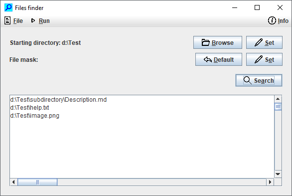

# Files finder
The Java application for finding files built by the Gradle

For the operation there must be the **starting directory** specified. It can be done by the directory browsing or manual by entering the value. So finds the application all files in the directory and in all subdirectories.

For the searching **by the file name** must be also the **file mask** specified. The file mask must be entered as the file name substring (for example **.java**), not as the operating system mask (for example **\*.java**)

## Versions
Now in March 2020 my version of Java is (OpenJDK) **12.0.2** and my version of Gradle is **5.2.1**. I also successfully tested old Java version (SE) **1.7.0_80** and Gradle **4.10.3**.

The current **Java compatibility setting** in the project is the version **1.7**. If You want to set the version 1.8 or newer, please change the line `sourceCompatibility = 1.7` of *build.gradle* file.

### Cloning to your computer
- install [GIT] and [Java JDK] on your computer
- set the operating system environment variable `JAVA_HOME` (the Java machine executable must be located on **%JAVA_HOME%\bin\java.exe**)
- install [Gradle Build Tool] on your computer
- clone this repository to your computer by the GIT command `git clone https://github.com/petrfaltus/java-files-finder-gradle.git`

### Running under Windows
- the batch *_make.bat* builds the project, it creates the executable **JAR** file (**Java archive**) and the **EXE** file (**Windows executable**)
- the batch *_run_java_archive.bat* launches the Java archive file in the **build\libs** directory
- the batch *_run_windows_executable.bat* launches the Windows executable file in the **build\launch4j** directory
- the batch *_clean* deletes files and directories created at the time of Gradle building

### Running under Linux
- build the project by the command `gradle assemble build createExe`
- launch the Java archive file by the command `java -jar build/libs/filesfinder-1.0-SNAPSHOT.jar`

Warning - both files *settings.gradle* and *build.gradle* have the **Windows line endings** (**CR+LF**), not Linux line endings (LF)

## To do (my plans to the future)
- the application should also search the text **in the body** of files
- the text searching should also support **regular expressions**

[GIT]: <https://git-scm.com/>
[Java JDK]: <https://www.oracle.com/java/technologies/javase-downloads.html>
[Gradle Build Tool]: <https://gradle.org/>
